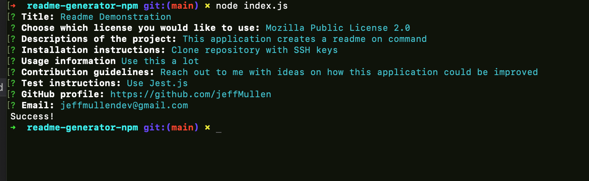

# Readme Generator

  ## Table of Contents
  * [Description](#description)
  * [Technologies Used](#technologies-used)
  * [Functionality](#functionality)
  * [Sample README](#sample-readme)
  * [Video Demonstration](#video-demonstration)
  * [Questions](#questions)

  ## License 
  This project is covered under the MIT License.
    
  
  
  - Click on the badge to see **MIT License** details.

  ## Description
  App designed to generate a README.md file based on responses to various questions prompted in the Command Line Interface.

  

  ## Technologies Used
  - Node.js was used as a runtime environment for the user to interact with this Command Line Interface application.

    * The File System package was used to dynamically write a README to a new file.

  - The Inquirer NPM package was used to create an array of questions that the user will interact with.
  
  - JavaScript was used to write the logic of this program.  Node.js allows for JavaScript to be used as a server-side language.

  ## Functionality
  - Application is invoked by entering "node index.js" into the Command Line Interface.

  - User is asked a series of questions.
    
  - Responses are sent to external JavaScript sheet to be injected into a pre-made markdown file.

  - Markdown file is generated and available to be included in user's project repository.
  
  ## Sample README
  - Link to sample [README](./sample-readme/generateReadme.md)

  ## Video Demonstration
  - Link to video [demonstration](https://drive.google.com/file/d/1fKFZnUkkVQHlU3_wphIZFHM15PV_YB4t/view?usp=sharing)

  ## Questions
  
  [github.com/jeffMullen](https://github.com/jeffMullen)

  If you have additional questions, feel free to reach me at jeffmullendev@gmail.com.